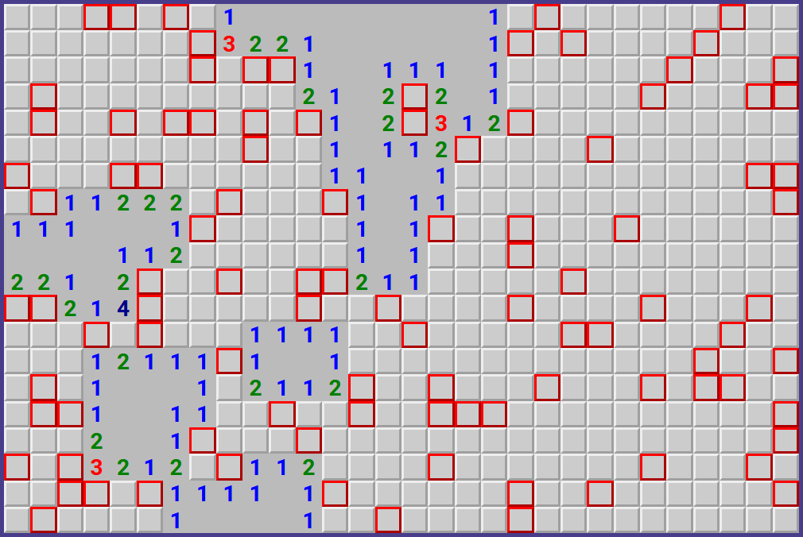

# minesweeper
Welcome to this new project! This time I'm ~~procrastinating the HTML forms course~~ making another game: the classic Minesweeper.

This time I want to make use of `JS`'s objects. My previous project, [Lights Out](https://github.com/HectorVilas/lights-out), was made with primitives and a lot of code got mixed and hard to read, so I better start using some objects for a tidy code.

## play the game
# https://hectorvilas.github.io/minesweeper/

## roadmap:
This is just a to-do a list to keep track of the progress. More will be added while the project keeps evolving.

- ✅ write down the README file

### design:
- ✅ height must be same as window size to prevent scrolling
- ✅ board must scale with window
- ✅ board must keep aspect ratio

### things to display on screen:
- ✅ the board
- ❌ ~~counters~~
- - ❌ ~~remaining mines~~
- - ❌ ~~time played~~
- ❌ ~~classic smiley face~~
- ✅ menu buttons

### game options and buttons:
- ✅ how to play
- ✅ settings
- - ✅ number of mines
- - ✅ board size (X and Y)
- ✅ about
- - ✅ link to my Github profile
- - ❌ ~~credits for any media I may use~~

### board generation:
- ✅ the board must be generated
- - ✅ width and height defined by option settings
- ✅ mines will be hidden in the board
- - ✅ quantity defined by option settings
- - ✅ the position will be randomized

### game logic:
- ✅ when a tile is clicked
- - ✅ if there's a mine
- - - ✅ show it and reveal the rest of the mines
- - - ✅ the game is over
- - - ✅ the player can't keep clicking on the board without starting again
- - ✅ else, show the number of mines surrounding the tile
- - - ✅ if there's no mines, nothing will be shown
- - - ✅ the surrounding tiles will auto-reveal until there's a mine around
- ❌ ~~right click must add a flag to mark a mine~~
- - ❌ ~~every flag must reduce the mine counter by one~~
- - ❌ ~~player can't put more flag than the number of mines~~
- - ❌ ~~in case of a present flag, it will be removed~~
- ✅ when all mines has been discovered and tiles without mines revealed
- - ✅ the game ends, announcing it
- - ❌ ~~remaining flags will be placed over the mines~~
- - ❌ ~~the timer must stop~~

### other ideas:
- ❌ ~~a graphic minefield~~
- ❌ ~~non-rectangular board shapes~~
- ❌ ~~num type input items changes board size in real time~~
- ❌ ~~sounds~~
- - ❌ ~~sound toggle button in options~~
- ❌ ~~show the README.md in the page~~
- ❌ ~~replace numbers for images (preventing bad tile scaling)~~

## update 1
I just made a simple page with some style to start with the game. I wasn't sure how to make it, so I went again for a really simple aestetic, I can change it later.

The board is being generated with `JS` and all the board related attributes are held as an object. This is the first time I make something like this.

I still have some problems with the board scaling. I can make it shrink with the navigator window horizontally or vertically, but not both ways. I can't figure it out. Another problem is how it looks with too much or too little tiles on screen. May adjust the scaling depending on the total tiles so these don't look too big or too small. In this case I may remove the dynamic scaling.

Now I've been thinking: how should I proceed? Should I make a 2D array to store the bombs, clicked tiles with it's number of mines around it and flags and then update the board? Or should I just make some array with the mines position and don't redraw too much in the screen? The former sounds easier to make, but I think the latter is the best way to proceed.

## update 2
I just wrote the basic object for the mines. Just for testing, 20 mines will be randomly placed and shown in red on the board. Now I need to store those coordinates instead of making those visible to the player.

Thoughts: creating and using objects is so easy, I don't know why I didn't used them before. The code is much easier to read. I'm also avoiding using semicolons because the code looks really clean. I was using them just because I got the habit from `C++` and `C#` (I just know the basics, the most advanced thing I made in those two was a Battleship game for the console). And the objects? Same case: I got some basic experience from those two languages while learning them just for fun.

**Note:** after finding an error, I just noticed semicolons are still important. What do I mean? This is an example:
```javascript
function test(){
  let a = 0
  let b = 1
  ; //semicolon after last variable declaration
  [a,b].forEach(x => console.log(x))
}
```
Without that semicolon, the `forEach` won't work, because:
>Uncaught ReferenceError: can't access lexical declaration 'b' before initialization

To prevent future errors, I'm going back to "semicolonize" everything. Maybe it's for the good, I want to go back to `C++` and `C#` in the future, so I better don't lose the habit.

## update 3
The tiles now have actions. Once the player clicks on one, if there's a mine in any of the eight surrounding tiles, the total number of mines will be displayed on it.

Playing a little I just noticed something: the randomizer can place another mine in the same occupied space, and it will show in the number revealing the surrounding mined tiles. I need a condition to check if there's a mine first and keep trying until it finds an empty space.

Something that worries me is: What if there's only a few available spaces? The `while` loop will go crazy generating thousand of coordinates until it hits the empty spot.

If I keep the mines number not too high (making the game less challenging), it won't be a problem, but I can try something in case I want to place 99 mines in a 10x10 board: make an array representing each tile, and the randomizer just removes an element for each mine, so it will never be selected twice.

## update 4
After trying a lot of ways to check if a generated coordinates for a mine is already occupied (and falling on infinite loops), I found a really simple way to do it. Check this snippet:

```javascript
// ...
let x = rand(board.width);
let y = rand(board.height);

let posToString = [];
mines.positions.forEach(pos => posToString.push(pos.toString()));

while (posToString.includes([x,y].toString())){
  x = rand(board.width);
  y = rand(board.height);
};
// ...
```
For `JS` this is false: `[1,2] == [1,2]` so I did this:

- declared `posToString` variable with an empty array
- transformed each array inside the main array to a string and placed them in `posToString`
- now I can compare strings and get **true** or **false**
- if I get **true** (there's already a mine in that place), new coordinates (X and Y) will be generated

I'm pretty sure searching on internet for this exact problem would get me with the same or much better solution, but I'm still learning and I don't want to just search for the solution. Maybe some advanced array methods would be better, may change this snippet of code in the future.

Another change I made in the code: Instead of choosing colors with a long switch-case, I just placed the colors' name in an array and used the index to define the color.

**Note:** I tried to make a recursion function to reveal all the surrounding tiles not surrounded by any mines until finding one, but failed horribly (and got a stack overflow situation or revealed the entire board). Maybe I should make another function for this, or try again after modifying some code.

## update 5
I can't believe it, I made a recursive function, I finally made it! Some conditions here and there and here it is, the function to reveal all the surroundings tiles not surrounded by mines. It will reveal all the conected tiles until it finds a surrounded one and stop propagating from there.

I've been all the day trying to make it, and it feels so simple now... This project was a really good idea to keep learning. I'm so happy right now, the satisfaction is immeasurable.



## update 6
I made a "dev tool" (it's just an object with a function) to toggle the mines visibility. I also hid all the revealed mines and added a basic, temporal "lose condition" that will prompt a message if your selected tile have a mine, then all the mines will be revealed with that same "dev tool" function. Maybe I should rename it.

Now the game is playable, but even after losing the player is still able to keep playing. I should remove all the event listeners, maybe my next step.

## update 7
I added an "options" menu, it will show or hide clicking on the placeholder icon at the tip right of the page. In the options menu there's 3 sliders: 2 for selecting board width and height and a third one for the quantity of mines. The "how to play" and "about" are placeholders for now.

To prevent players to select more mines than available tiles, if  `board.width * board.height` is lower than the mines count, it will automatically adjust it's max value to prevent an infinite loop.

## update 8
As it's impossible to remove an event listener with an anonymous function, I added a boolean variable for game over status. The code inside de anonymous fuction will only run if the game is not over.

At the same time, I made a function to check if there's any remaining tile without a mine to reveal. If there's none, player wins.

**Thoughts:** my code is so bad... I was thinking about it while lying the bed, and thought a better way to make, well, everything. My first idea of making a 2D array was the best solution, and the numbers should be calculated while the mines are randomized instead of on every click. Also the `HTML` classes and `CSS` needs a complete rework. I must change my workflow to simplify a lot of it, and I think I know how. I'll keep updating this game until I have the basic functionality and then make a second version in the future, with better code. Sorry, game, it was fun but a bad code is a bad code and I'm not Notch enough to get away with it (just kidding).

# announce
I'm going to  make this game again, from scratch, so I'm going to archive this repository, to keep as reference to see my progress. The roadmap will be the same.

See you in the ~~next project~~ remake! Haha!